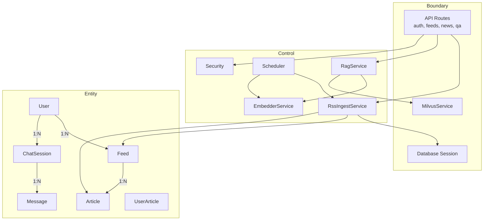
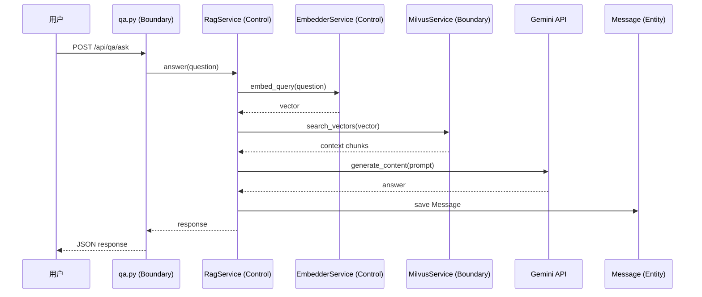

# RSS Reader 后端 BCE 架构分析

## 概述

本文档使用 **BCE（Boundary-Control-Entity）** 模式分析 RSS Reader 后端架构。

| 层级 | 说明 | 对应目录 |
|------|------|----------|
| **Boundary** | 系统边界，与外部交互 | `api/`, `vector/` |
| **Control** | 业务逻辑协调 | `services/`, `tasks/`, `core/` |
| **Entity** | 领域模型 | `models/`, `schemas/` |

---

## 🔵 Boundary（边界类）

与外部系统/用户交互的接口层。

### API 接口

| 文件 | 模块 | 说明 | 交互对象 |
|------|------|------|----------|
| [auth.py](file:///c:/Users/Orion/Desktop/rssReader/backend/app/api/auth.py) | `router` | 认证 API（登录/注册） | 用户 |
| [feeds.py](file:///c:/Users/Orion/Desktop/rssReader/backend/app/api/feeds.py) | `router` | 订阅源管理 API | 用户 |
| [news.py](file:///c:/Users/Orion/Desktop/rssReader/backend/app/api/news.py) | `router` | 新闻文章 API | 用户 |
| [qa.py](file:///c:/Users/Orion/Desktop/rssReader/backend/app/api/qa.py) | `router` | AI 问答 API | 用户 |

### 外部服务客户端

| 文件 | 类 | 说明 | 交互对象 |
|------|-----|------|----------|
| [milvus.py](file:///c:/Users/Orion/Desktop/rssReader/backend/app/vector/milvus.py) | `MilvusService` | 向量库客户端 | Milvus |
| [session.py](file:///c:/Users/Orion/Desktop/rssReader/backend/app/db/session.py) | `engine` | 数据库连接 | PostgreSQL |

---

## 🟢 Control（控制类）

业务逻辑和流程协调。

### 核心服务

| 文件 | 类 | 职责 |
|------|-----|------|
| [rss_ingest.py](file:///c:/Users/Orion/Desktop/rssReader/backend/app/services/rss_ingest.py) | `RssIngestService` | RSS 抓取、解析、去重、入库 |
| [embedder.py](file:///c:/Users/Orion/Desktop/rssReader/backend/app/services/embedder.py) | `EmbedderService` | 文本向量化 (Gemini) |
| [rag.py](file:///c:/Users/Orion/Desktop/rssReader/backend/app/services/rag.py) | `RagService` | RAG 检索增强生成 |

### 基础设施

| 文件 | 类/模块 | 职责 |
|------|---------|------|
| [scheduler.py](file:///c:/Users/Orion/Desktop/rssReader/backend/app/tasks/scheduler.py) | `BackgroundScheduler` | 定时任务调度 |
| [security.py](file:///c:/Users/Orion/Desktop/rssReader/backend/app/core/security.py) | - | 密码哈希、JWT |
| [config.py](file:///c:/Users/Orion/Desktop/rssReader/backend/app/core/config.py) | `Settings` | 配置管理 |

---

## 🟡 Entity（实体类）

领域数据模型。

### 数据库模型

| 文件 | 类 | 核心属性 | 关系 |
|------|-----|----------|------|
| [user.py](file:///c:/Users/Orion/Desktop/rssReader/backend/app/models/user.py) | `User` | id, username, email, hashed_password | 1:N → Feed |
| [feed.py](file:///c:/Users/Orion/Desktop/rssReader/backend/app/models/feed.py) | `Feed` | id, user_id, title, url | N:1 → User, 1:N → Article |
| [article.py](file:///c:/Users/Orion/Desktop/rssReader/backend/app/models/article.py) | `Article` | id, feed_id, title, url, content, is_vectorized | N:1 → Feed |
| [message.py](file:///c:/Users/Orion/Desktop/rssReader/backend/app/models/message.py) | `ChatSession` | id, user_id, article_id | 1:N → Message |
| [message.py](file:///c:/Users/Orion/Desktop/rssReader/backend/app/models/message.py) | `Message` | id, session_id, role, content, citations | N:1 → ChatSession |
| [user_article.py](file:///c:/Users/Orion/Desktop/rssReader/backend/app/models/user_article.py) | `UserArticle` | user_id, article_id, is_read | 关联表 |

### 数据传输对象 (DTO)

| 文件 | 类 | 用途 |
|------|-----|------|
| [feed.py](file:///c:/Users/Orion/Desktop/rssReader/backend/app/schemas/feed.py) | `FeedCreate`, `Feed` | 订阅源请求/响应 |
| [article.py](file:///c:/Users/Orion/Desktop/rssReader/backend/app/schemas/article.py) | `ArticleBase`, `Article` | 文章数据传输 |
| [qa.py](file:///c:/Users/Orion/Desktop/rssReader/backend/app/schemas/qa.py) | `QuestionRequest`, `AnswerResponse` | 问答请求/响应 |

---

## 类图



---

## 交互流程示例

### 用户提问 AI



---

## 目录结构

```
backend/app/
├── api/                # 🔵 Boundary - API 路由
│   ├── auth.py         #    认证接口
│   ├── feeds.py        #    订阅源管理
│   ├── news.py         #    新闻文章
│   └── qa.py           #    AI 问答
├── core/               # 🟢 Control - 核心配置
│   ├── config.py       #    环境配置
│   └── security.py     #    安全/认证
├── db/                 # 🔵 Boundary - 数据库连接
│   └── session.py
├── models/             # 🟡 Entity - 数据模型
│   ├── user.py
│   ├── feed.py
│   ├── article.py
│   ├── message.py
│   └── user_article.py
├── schemas/            # 🟡 Entity - DTO
│   ├── feed.py
│   ├── article.py
│   └── qa.py
├── services/           # 🟢 Control - 业务逻辑
│   ├── rss_ingest.py
│   ├── embedder.py
│   └── rag.py
├── tasks/              # 🟢 Control - 定时任务
│   └── scheduler.py
├── vector/             # 🔵 Boundary - 向量库
│   └── milvus.py
└── main.py             # 应用入口
```
